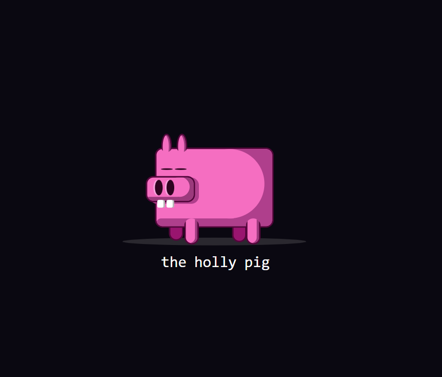

# The Holly Pig 🐷 - CSS Art

**The Holly Pig** es un dibujo gracioso de un cerdito creado completamente con **HTML** y **CSS**, sin usar imágenes ni gráficos externos. Este proyecto demuestra el poder de CSS para construir ilustraciones detalladas y creativas directamente en el navegador.

## Resultado

Aquí tienes una captura del diseño final:

Espero que este pequeño proyecto inspire a otros desarrolladores a explorar el mundo del **CSS Art** y a experimentar con sus propias creaciones. 🎨